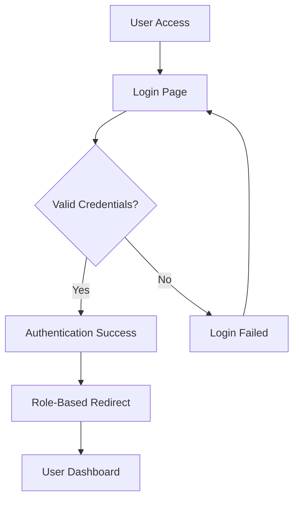
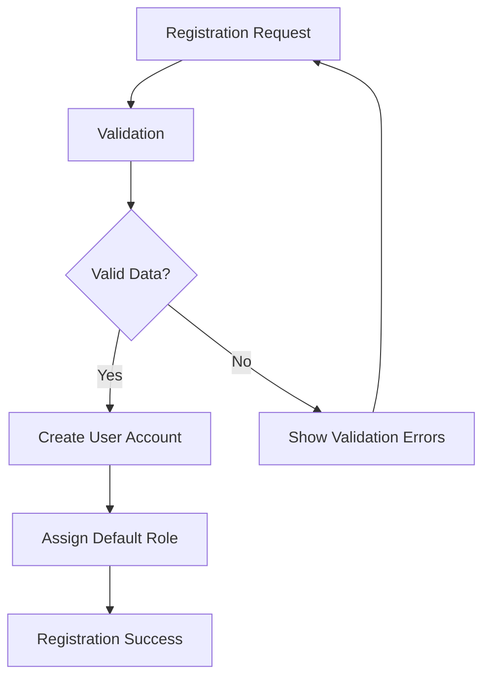
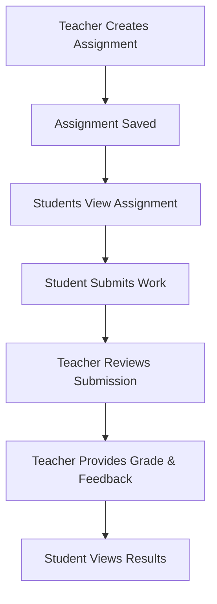
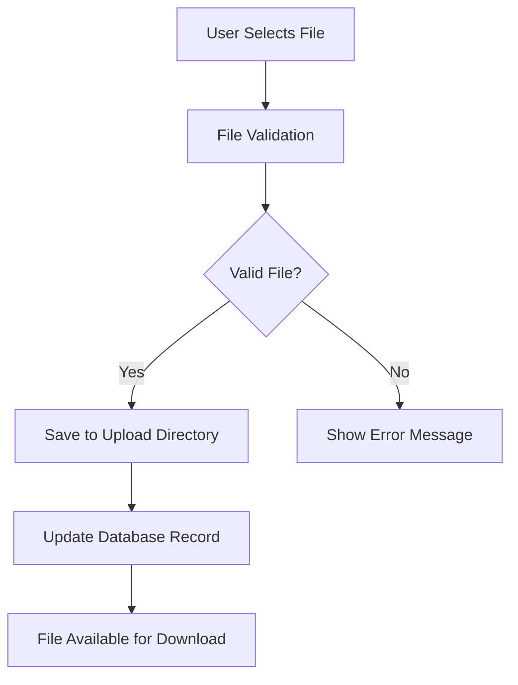

# Student Management System - Project Documentation

## Table of Contents
1. [Project Overview](#project-overview)
2. [Technology Stack](#technology-stack)
3. [System Architecture](#system-architecture)
4. [User Roles & Permissions](#user-roles--permissions)
5. [Project Flow](#project-flow)
6. [Use Cases](#use-cases)
7. [Database Design](#database-design)
8. [API Endpoints](#api-endpoints)
9. [Security Implementation](#security-implementation)
10. [File Structure](#file-structure)
11. [Setup & Installation](#setup--installation)

## Project Overview

The Student Management System is a comprehensive web-based application designed to digitize and streamline educational institution operations. It provides a unified platform for students, teachers, parents, administrators, and staff to interact, manage academic activities, and maintain institutional records.

### Key Objectives
- **Digital Transformation**: Convert traditional paper-based processes to digital workflows
- **Role-Based Access**: Provide tailored experiences for different user types
- **Communication Hub**: Enable seamless communication between all stakeholders
- **Academic Management**: Streamline assignment submission, grading, and attendance tracking
- **Administrative Efficiency**: Automate routine administrative tasks

## Technology Stack

### Backend Technologies
- **Framework**: Spring Boot 3.5.4
- **Language**: Java 21
- **Security**: Spring Security 6
- **Database**: MySQL with Spring Data JPA
- **Build Tool**: Maven
- **Template Engine**: Thymeleaf

### Frontend Technologies
- **CSS Framework**: Tailwind CSS
- **JavaScript**: Vanilla JS with Node.js build tools
- **Template Engine**: Thymeleaf for server-side rendering

### Additional Tools
- **ORM**: Hibernate (via Spring Data JPA)
- **Validation**: Bean Validation (JSR-303)
- **Logging**: Spring Boot default logging
- **Development**: Spring Boot DevTools

## System Architecture

### Architectural Pattern
The system follows the **Model-View-Controller (MVC)** pattern with a layered architecture:

```
┌─────────────────────────────────────────┐
│              Presentation Layer          │
│         (Controllers + Views)           │
├─────────────────────────────────────────┤
│              Service Layer              │
│           (Business Logic)              │
├─────────────────────────────────────────┤
│            Repository Layer             │
│            (Data Access)                │
├─────────────────────────────────────────┤
│              Database Layer             │
│              (MySQL)                    │
└─────────────────────────────────────────┘
```

### Package Structure
```
com.student_management_system/
├── admin/                 # Admin-specific functionality
├── common/               # Shared components
├── config/               # Configuration classes
├── init/                 # Application initialization
├── parent/               # Parent-specific functionality
├── principal/            # Principal-specific functionality
├── staff/                # Staff-specific functionality
├── student/              # Student-specific functionality
├── teacher/              # Teacher-specific functionality
└── user_management/      # Authentication & user management
```

## User Roles & Permissions

### 1. **ROLE_STUDENT**
- View personal timetable
- Submit assignments
- View grades and feedback
- Access study materials
- View attendance records

### 2. **ROLE_TEACHER**
- Manage student assignments
- Mark attendance
- Upload study materials
- Grade student work
- Communicate with parents
- View class schedules

### 3. **ROLE_PARENT**
- View child's academic progress
- Communicate with teachers
- View attendance records
- Access school announcements
- View child's assignments and grades

### 4. **ROLE_ADMIN**
- Manage all user accounts
- Generate system reports
- Handle fee management
- System configuration
- User role assignment

### 5. **ROLE_PRINCIPAL**
- Oversee all academic activities
- Approve budget requests
- Manage school policies
- View comprehensive reports
- Handle parent communications

### 6. **ROLE_STAFF**
- Manage school events
- Handle facility bookings
- Process administrative requests
- Maintain school records

## Project Flow

### 1. **Authentication Flow**


### 2. **User Registration Flow**


### 3. **Assignment Management Flow**


### 4. **File Upload Flow**


## Use Cases

### Student Use Cases

#### UC-S1: View Personal Dashboard
- **Actor**: Student
- **Description**: Student logs in and views personalized dashboard with recent assignments, grades, and announcements
- **Preconditions**: Student must be authenticated
- **Flow**:
  1. Student navigates to dashboard
  2. System displays recent assignments
  3. System shows upcoming deadlines
  4. System displays latest grades
  5. System shows school announcements

#### UC-S2: Submit Assignment
- **Actor**: Student
- **Description**: Student submits assignment for a specific subject
- **Preconditions**: Assignment must be available and not past due date
- **Flow**:
  1. Student selects assignment
  2. Student uploads file or enters text
  3. System validates submission
  4. System saves submission with timestamp
  5. System confirms successful submission

#### UC-S3: View Timetable
- **Actor**: Student
- **Description**: Student views personal class schedule
- **Preconditions**: Student must be enrolled in classes
- **Flow**:
  1. Student accesses timetable section
  2. System retrieves student's enrolled subjects
  3. System displays weekly schedule
  4. System shows room numbers and teacher information

### Teacher Use Cases

#### UC-T1: Manage Assignments
- **Actor**: Teacher
- **Description**: Teacher creates, updates, and grades assignments
- **Preconditions**: Teacher must be assigned to subjects
- **Flow**:
  1. Teacher accesses assignment management
  2. Teacher creates new assignment with details
  3. System saves assignment and makes it available to students
  4. Teacher reviews student submissions
  5. Teacher provides grades and feedback

#### UC-T2: Mark Attendance
- **Actor**: Teacher
- **Description**: Teacher records student attendance for classes
- **Preconditions**: Teacher must have scheduled classes
- **Flow**:
  1. Teacher selects class and date
  2. System displays enrolled students
  3. Teacher marks present/absent for each student
  4. System saves attendance records
  5. System updates attendance statistics

#### UC-T3: Upload Study Materials
- **Actor**: Teacher
- **Description**: Teacher uploads educational resources for students
- **Preconditions**: Teacher must be assigned to subjects
- **Flow**:
  1. Teacher selects subject
  2. Teacher uploads file with description
  3. System validates file type and size
  4. System saves file to storage
  5. System makes material available to students

### Parent Use Cases

#### UC-P1: View Child's Progress
- **Actor**: Parent
- **Description**: Parent monitors child's academic performance
- **Preconditions**: Parent account must be linked to student
- **Flow**:
  1. Parent accesses child's profile
  2. System displays recent grades
  3. System shows attendance records
  4. System displays assignment submissions
  5. System shows teacher feedback

#### UC-P2: Communicate with Teachers
- **Actor**: Parent
- **Description**: Parent sends messages to child's teachers
- **Preconditions**: Parent must be linked to student account
- **Flow**:
  1. Parent selects teacher to contact
  2. Parent composes message
  3. System sends message to teacher
  4. System notifies teacher of new message
  5. Teacher can respond to parent

### Admin Use Cases

#### UC-A1: Manage User Accounts
- **Actor**: Admin
- **Description**: Admin creates, updates, and manages user accounts
- **Preconditions**: Admin must have appropriate permissions
- **Flow**:
  1. Admin accesses user management
  2. Admin creates/edits user account
  3. Admin assigns appropriate role
  4. System validates user data
  5. System saves user account

#### UC-A2: Generate Reports
- **Actor**: Admin
- **Description**: Admin generates various system reports
- **Preconditions**: Sufficient data must exist in system
- **Flow**:
  1. Admin selects report type
  2. Admin specifies date range and filters
  3. System processes data
  4. System generates report
  5. Admin can export or print report

### Principal Use Cases

#### UC-PR1: Approve Budget Requests
- **Actor**: Principal
- **Description**: Principal reviews and approves budget requests from staff
- **Preconditions**: Budget requests must be submitted
- **Flow**:
  1. Principal views pending requests
  2. Principal reviews request details
  3. Principal approves or rejects request
  4. System updates request status
  5. System notifies requester of decision

#### UC-PR2: Oversee School Operations
- **Actor**: Principal
- **Description**: Principal monitors overall school performance
- **Preconditions**: Principal must have access to all modules
- **Flow**:
  1. Principal accesses comprehensive dashboard
  2. System displays key performance indicators
  3. System shows attendance statistics
  4. System displays academic performance metrics
  5. Principal can drill down into specific areas

### Staff Use Cases

#### UC-ST1: Manage School Events
- **Actor**: Staff
- **Description**: Staff creates and manages school events
- **Preconditions**: Staff must have event management permissions
- **Flow**:
  1. Staff creates new event
  2. Staff sets event details and date
  3. System saves event information
  4. System makes event visible to relevant users
  5. Staff can update or cancel events

#### UC-ST2: Handle Facility Bookings
- **Actor**: Staff
- **Description**: Staff manages facility reservations
- **Preconditions**: Facilities must be defined in system
- **Flow**:
  1. Staff receives booking request
  2. Staff checks facility availability
  3. Staff approves or rejects booking
  4. System updates facility calendar
  5. System notifies requester of decision

## Database Design

### Core Entities

#### User Entity
```sql
users (
    id BIGINT PRIMARY KEY AUTO_INCREMENT,
    username VARCHAR(255) UNIQUE NOT NULL,
    password VARCHAR(255) NOT NULL,
    email VARCHAR(255) NOT NULL,
    enabled BOOLEAN DEFAULT TRUE,
    role ENUM('ROLE_STUDENT', 'ROLE_TEACHER', 'ROLE_PARENT', 'ROLE_ADMIN', 'ROLE_PRINCIPAL', 'ROLE_STAFF'),
    parent_id BIGINT FOREIGN KEY REFERENCES users(id)
);
```

#### Assignment Entity
```sql
assignment (
    id BIGINT PRIMARY KEY AUTO_INCREMENT,
    title VARCHAR(255) NOT NULL,
    description TEXT,
    submission_text TEXT,
    submission_date DATETIME,
    due_date DATE,
    grade VARCHAR(50),
    feedback TEXT,
    status ENUM('PENDING', 'SUBMITTED', 'GRADED'),
    subject_id BIGINT FOREIGN KEY REFERENCES subject(id),
    user_id BIGINT FOREIGN KEY REFERENCES users(id),
    teacher_id BIGINT FOREIGN KEY REFERENCES users(id)
);
```

#### Subject Entity
```sql
subject (
    id BIGINT PRIMARY KEY AUTO_INCREMENT,
    name VARCHAR(255) NOT NULL,
    code VARCHAR(50) UNIQUE,
    description TEXT
);
```

### Relationships
- **User-Assignment**: One-to-Many (A user can have multiple assignments)
- **Subject-Assignment**: One-to-Many (A subject can have multiple assignments)
- **User-User**: Self-referencing (Parent-Child relationship)
- **User-Message**: One-to-Many (A user can send/receive multiple messages)

## API Endpoints

### Authentication Endpoints
- `GET /` - Home page
- `GET /login` - Login page
- `POST /login` - Process login
- `GET /register` - Registration page
- `POST /register` - Process registration
- `POST /logout` - Logout user

### Student Endpoints
- `GET /student/dashboard` - Student dashboard
- `GET /student/assignments` - View assignments
- `POST /student/assignments/{id}/submit` - Submit assignment
- `GET /student/materials` - View study materials
- `GET /student/timetable` - View timetable

### Teacher Endpoints
- `GET /teacher/dashboard` - Teacher dashboard
- `GET /teacher/assignments` - Manage assignments
- `POST /teacher/assignments` - Create assignment
- `GET /teacher/attendance` - Attendance management
- `POST /teacher/attendance` - Mark attendance
- `GET /teacher/materials` - Manage materials
- `POST /teacher/materials/upload` - Upload material

### Admin Endpoints
- `GET /admin/dashboard` - Admin dashboard
- `GET /admin/users` - User management
- `POST /admin/users` - Create user
- `GET /admin/reports` - Generate reports

### Common Endpoints
- `GET /messages` - View messages
- `POST /messages` - Send message
- `GET /profile` - User profile
- `POST /profile` - Update profile

## Security Implementation

### Authentication
- **Spring Security** with form-based authentication
- **BCrypt** password encoding
- **Custom UserDetailsService** for user authentication
- **Session-based** authentication

### Authorization
- **Role-based access control** using Spring Security
- **Method-level security** for sensitive operations
- **URL-based security** configuration
- **Custom success handler** for role-based redirects

### Security Configuration
```java
@Configuration
@EnableWebSecurity
public class SecurityConfig {
    // Role-based URL protection
    .requestMatchers("/admin/**").hasRole("ADMIN")
    .requestMatchers("/student/**").hasRole("STUDENT")
    .requestMatchers("/teacher/**").hasRole("TEACHER")
    // ... other role mappings
}
```

## File Structure

```
student-management-system/
├── src/
│   ├── main/
│   │   ├── java/com/student_management_system/
│   │   │   ├── admin/
│   │   │   │   ├── controller/
│   │   │   │   ├── dto/
│   │   │   │   └── service/
│   │   │   ├── common/
│   │   │   │   ├── controller/
│   │   │   │   ├── dto/
│   │   │   │   ├── exception/
│   │   │   │   ├── model/
│   │   │   │   ├── repository/
│   │   │   │   └── service/
│   │   │   ├── config/
│   │   │   ├── student/
│   │   │   ├── teacher/
│   │   │   ├── parent/
│   │   │   ├── principal/
│   │   │   ├── staff/
│   │   │   └── user_management/
│   │   └── resources/
│   │       ├── static/
│   │       ├── templates/
│   │       └── application.properties
│   └── test/
├── uploads/
├── pom.xml
├── package.json
├── tailwind.config.js
└── README.md
```

## Setup & Installation

### Prerequisites
- Java 21 or higher
- Maven 3.6+
- MySQL 8.0+
- Node.js 18+ (for Tailwind CSS)

### Installation Steps

1. **Clone the Repository**
   ```bash
   git clone <repository-url>
   cd student-management-system
   ```

2. **Database Setup**
   ```sql
   CREATE DATABASE student_management_db;
   CREATE USER 'student_app_user'@'localhost' IDENTIFIED BY 'root';
   GRANT ALL PRIVILEGES ON student_management_db.* TO 'student_app_user'@'localhost';
   ```

3. **Configure Application Properties**
   ```properties
   spring.datasource.url=jdbc:mysql://localhost:3308/student_management_db
   spring.datasource.username=student_app_user
   spring.datasource.password=root
   ```

4. **Install Dependencies**
   ```bash
   mvn clean install
   npm install
   ```

5. **Build CSS**
   ```bash
   npm run build:css
   ```

6. **Run Application**
   ```bash
   mvn spring-boot:run
   ```

7. **Access Application**
   - URL: `http://localhost:8081`
   - Default admin credentials will be created on first run

### Development Setup
- Enable Spring Boot DevTools for hot reloading
- Use `npm run watch:css` for CSS development
- Configure IDE for Java 21 and Maven

---

## Conclusion

This Student Management System provides a comprehensive solution for educational institutions looking to digitize their operations. The modular architecture, role-based security, and user-friendly interface make it suitable for schools of various sizes. The system can be extended with additional features like online examinations, library management, and mobile applications.

For support or contributions, please refer to the project repository and documentation.
